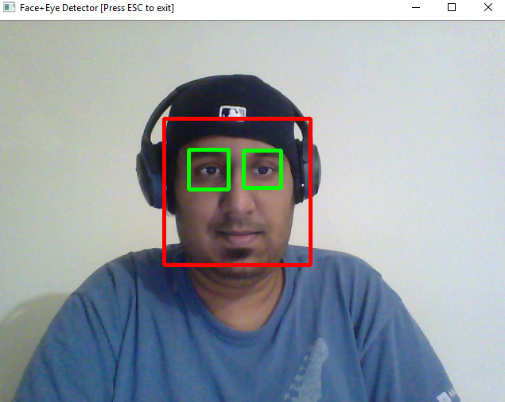
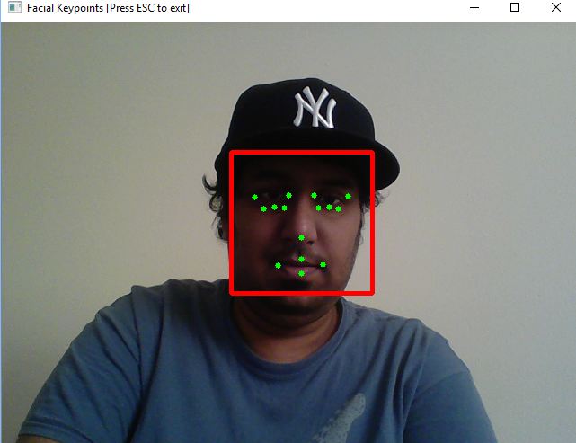

# Facial Keypoint Detection and Real-time Filtering

## Project Overview

In this project, we’ll combine our knowledge of computer vision techniques and deep learning to build and end-to-end facial keypoint recognition system. Facial keypoints include points around the eyes, nose, and mouth on any face and are used in many applications, from facial tracking to emotion recognition. The code is capable to take in any image containing faces and identify the location of each face and their facial keypoints, as shown below.

The project itself is broken down into three large parts, then even further into separate steps.  
**Part 1** : Investigating OpenCV, pre-processing, and face detection

* **Step 0**: Detect Faces Using a Haar Cascade Classifier
* **Step 1**: Add Eye Detection
* **Step 2**: De-noise an Image for Better Face Detection
* **Step 3**: Blur an Image and Perform Edge Detection
* **Step 4**: Automatically Hide the Identity of an Individual

**Part 2** : Training a Convolutional Neural Network (CNN) to detect facial keypoints

* **Step 5**: Create a CNN to Recognize Facial Keypoints
* **Step 6**: Compile and Train the Model
* **Step 7**: Visualize the Loss and Answer Questions

**Part 3** : Putting parts 1 and 2 together to identify facial keypoints on any image!

* **Step 8**: Build a Robust Facial Keypoints Detector (Complete the CV Pipeline)

## Results

